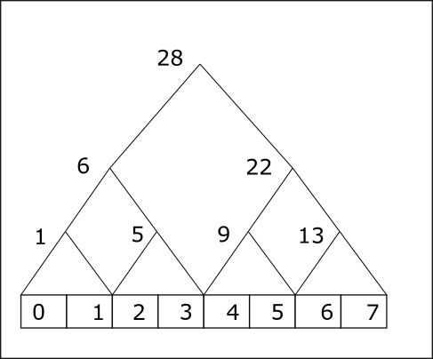

# Homework 2

## Grading

Unlike previous homeworks there is no autograding. This is because Github limits the number of
threads that can be created. Therefore, after the __deadline__ i will download your work to my computer and test it. That is why it is important that you test your code before your final submission.
As before you can commit as many times as you want until the deadline.

## Prefix sum

Given an array _A_ the prefix sum(or scan) computes the sum of all prefixes of _A_. For example, if ```A={1,2,3,4}``` then the call to ```scan(A)``` will result in ```A={1,3,6,10}```.

For the sequential version you can use the STL ```std::inclusive_scan``` ([reference](https://en.cppreference.com/w/cpp/algorithm/inclusive_scan)). To make sure that you get the correct result use version 5 in the reference, i.e.

```cpp
std::inclusive_scan(first,last,o_first,std::plus{},0.0);
```
Where _first_ and _last_ are the range of the input and _o\_first_ the beginning of the output, which in this homework we will set to _first_.

In this part you are asked to implement a parallel version of ```inclusive_scan``` in the file ```hw2.h```.
```cpp
template<typename T>
void parScan(std::vector<T>& v){

}
```
Make sure you compile with c++20 support so that you can use the ```barrier``` class. If you have an old compiler that does not support c++20 , you can use the barrier class supplied in ```barrier.h```
### Solution 
The solution to the above problem is done using  multiple phases with the help of a barrier. In the first phase, the range is divided into subranges and a thread computes scan on that range.
In subsequent phases, only threads with (id+1) is multiple of a stride will participate by adding the last of value of the previous range to each value in its own range.

A simple example with 16 elements and 8 threads is shown in the figure below.



## Quicksort

In this part you need to implement a parallel version of quicksort in ```hw2.h```. This is done in three steps
1. Write an implementation of ```partition``` (refer to your Data Structure notes).

```cpp
template<Iter>
Iter partition(Iter start,Iter end)
```
It partitions the input range into two parts: the "left" one are all the values less or equal to the pivot, and
a "right" part containing all the values larger than the pivot. Since the input range are all random numbers always
use the first element, i.e. ```*start``` as the pivot. The return value is an iterator to the pivot which, after
partition returns, will be in "between" the two parts.

2. Implement a sequential version of quicksort

```cpp
template<typename Iter>
void seqQuicksort(Iter start, Iter end) {
}

```
3. Implement a parallel version of quicksort

```cpp
template<typename Iter>
void parQuicksort(Iter start, Iter end) {
}
```
Unlike previous examples, the parallel version of quicksort is "top down" instead of "bottom up". A given call
to quicksort calls partition to divide the input range into two parts as described above. Then a thread is created
to sort each part independently. To minimize the overhead of creating too many threads we define a __cutoff__ size
for the range below which, an iterative sorting algorithm, such as insertion sort, is called. A good cutoff would restrict the number of created thread to 
less than 64. After the cutoff you can use ```std::sort```.
